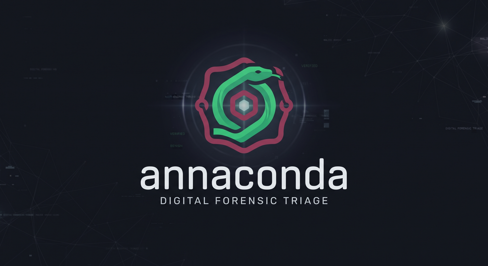
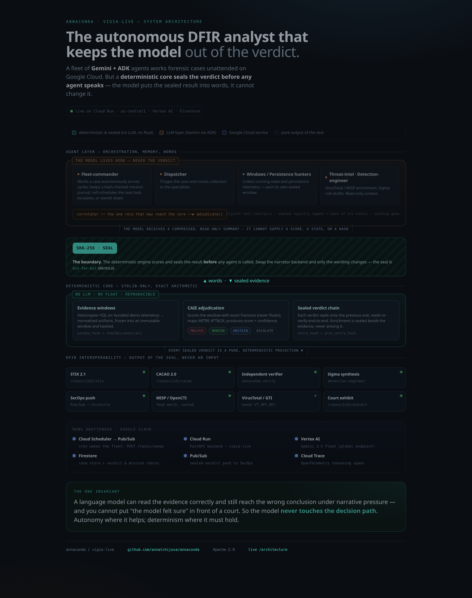
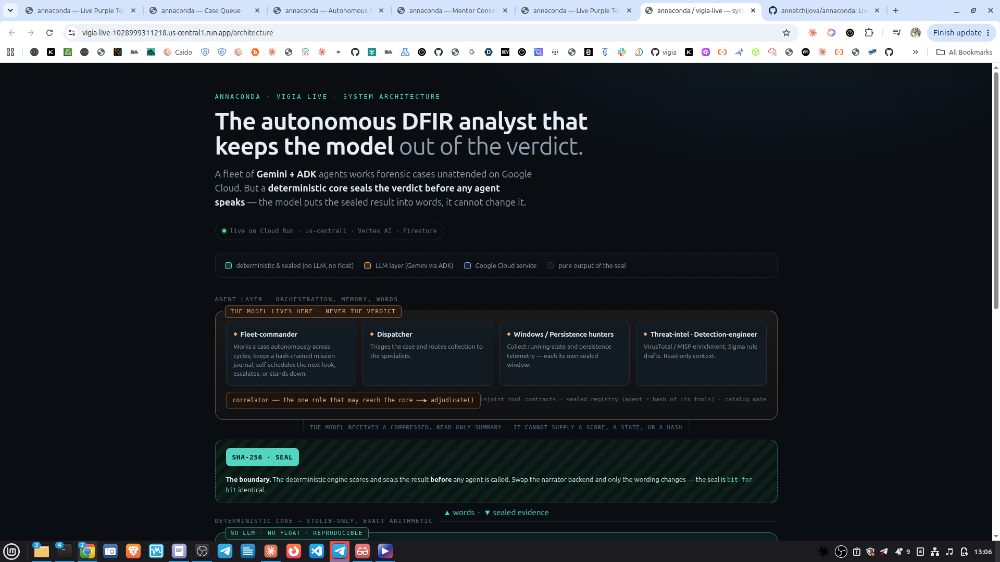
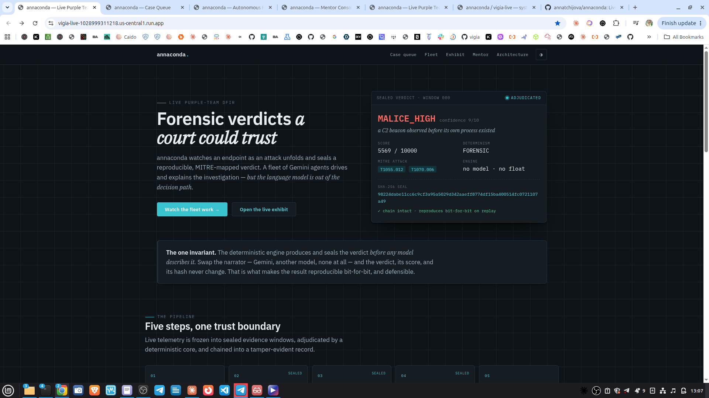
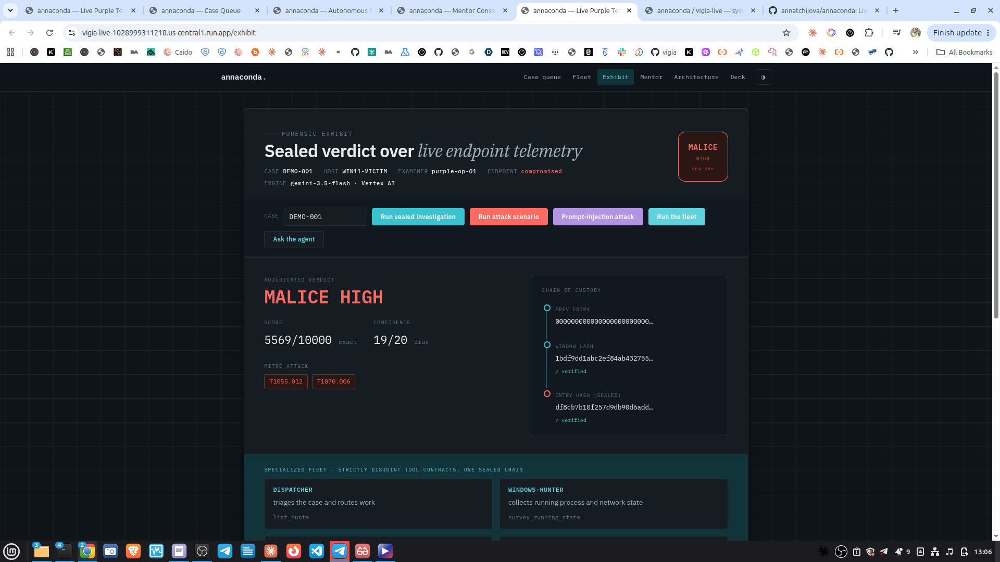
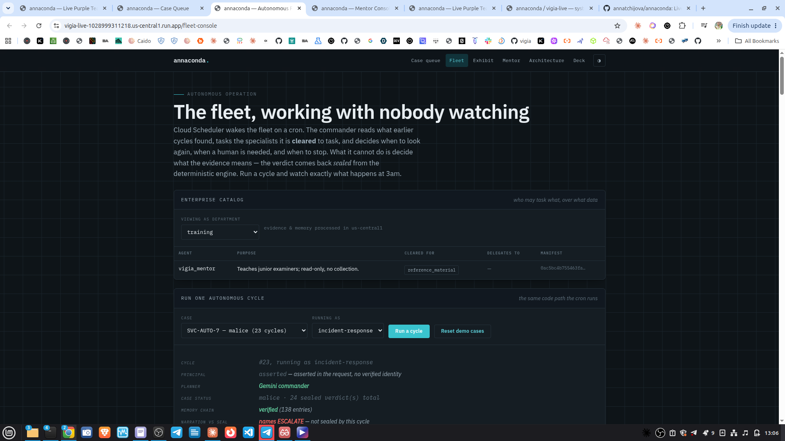
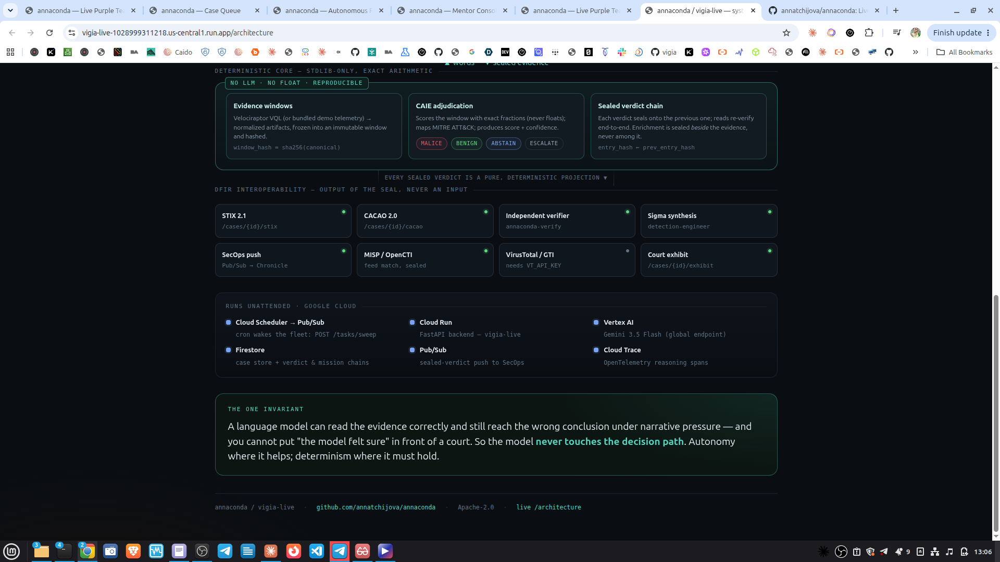
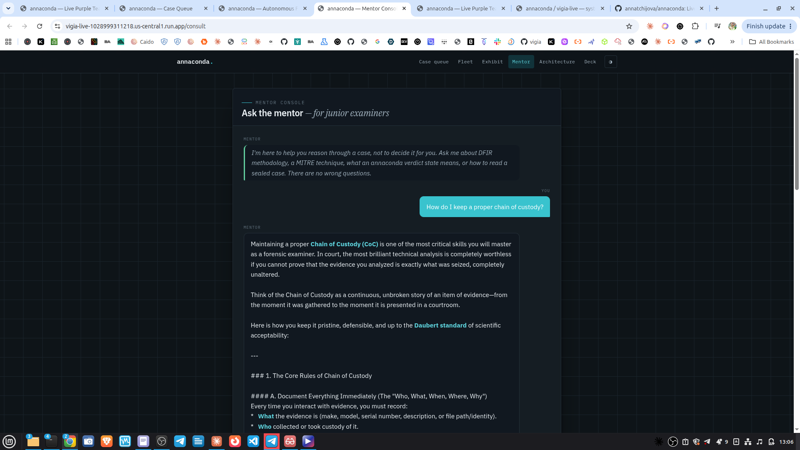
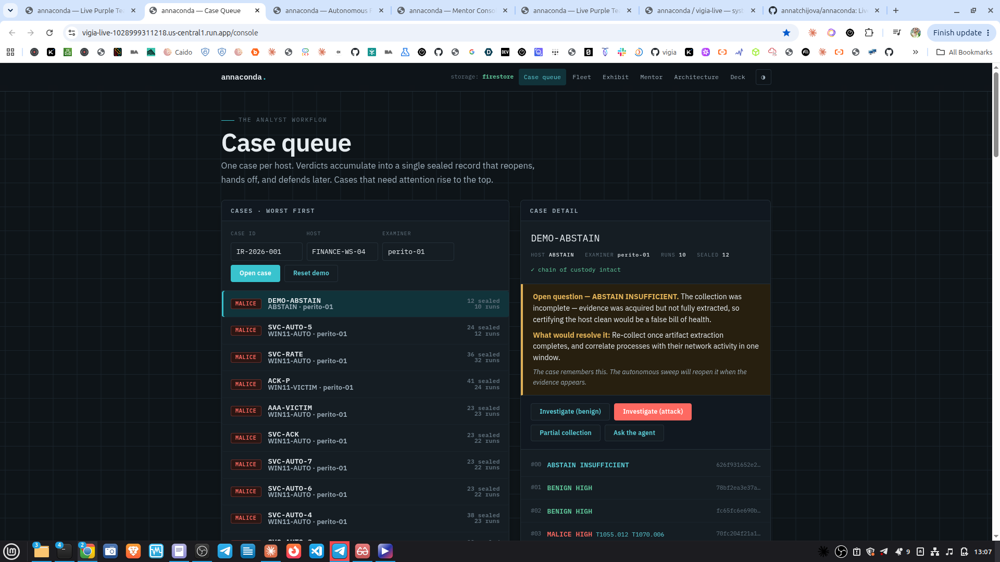
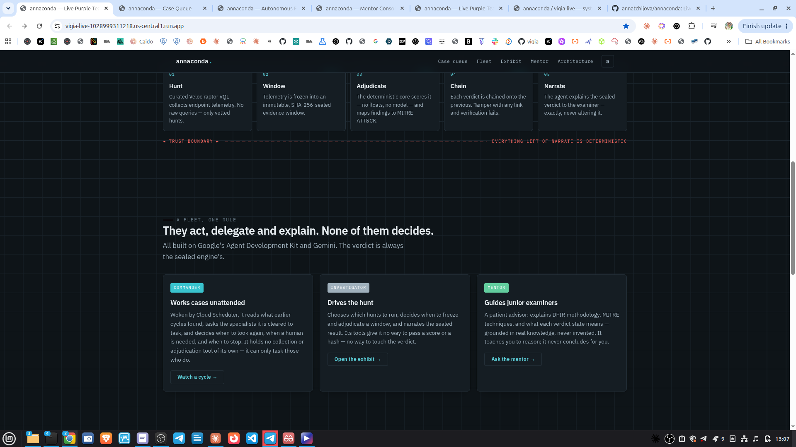

<p align="center">
  
</p>

# annaconda

## Purple-team DFIR · a multi-agent fleet · real-time endpoint telemetry from Velociraptor

**annaconda works the endpoint while the attack is still unfolding.** It pulls
live telemetry off the host through Velociraptor's own VQL engine, freezes what
it collected into a hash-sealed evidence window, and adjudicates a reproducible,
MITRE-mapped verdict — all *before* any language model is allowed to speak. A
fleet of Google ADK + Gemini agents works cases **unattended**: choosing what to
hunt, carrying an investigation's memory across weeks, escalating to a human when
one is needed. Swap the narrator and the verdict, its score, and its hash never
change.

The three things it is, at once:

- **Purple team, not post-mortem.** Red runs a technique; annaconda emits a
  sealed, MITRE-mapped verdict on the telemetry as it lands. Red and blue read
  one reproducible, tamper-evident account of what happened and whether the
  detection held — instead of arguing over two write-ups.
- **A multi-agent fleet with strictly disjoint powers.** A commander tasks six
  specialists (`agent/fleet.py`) — dispatcher, two hunters, threat-intel,
  detection-engineer, correlator — plus an investigator and a mentor outside the
  fleet. Exactly **one** of them can reach the sealed core, no tool belongs to
  two roles, and a test proves it (`tests/test_fleet.py`). They act, delegate and
  explain; **none of them decides**.
- **Real-time telemetry with Velociraptor.** Collection runs through curated VQL
  templates only — never free-form VQL from a model or a caller — against
  Velociraptor as an independent AGPLv3 service reached over its own interface,
  and the window is sealed at the moment of collection. See
  [Live telemetry](#live-telemetry-how-evidence-gets-in) for exactly how far this
  is proven today.

> Built for the **All Things Agentic Hackathon** (Google / Gemini).
> Live: **https://vigia-live-1028999311218.us-central1.run.app**
> Pitch deck: **https://vigia-live-1028999311218.us-central1.run.app/deck#1**

---

## The one invariant

A language model can read evidence correctly and still reach the wrong
conclusion under narrative pressure. So in annaconda the model never touches the
verdict:

- The deterministic core scores the evidence with exact arithmetic (fractions,
  **no floating point**) and **seals** the result with SHA-256 before any agent
  is called.
- The agent's tools give it **no way to pass a score, a state, or a hash** — it
  can choose *what to investigate* and *put the result into words*, nothing more.
- Every verdict is chained onto the previous one, so a case is one tamper-evident
  record. Re-running the same evidence reproduces every seal **bit-for-bit**.

This is what makes the output defensible: reproducible, auditable, and immune to
whatever the model happens to say.

## Live telemetry: how evidence gets in

Evidence reaches the engine through Velociraptor, and the path is deliberately
narrow (`tools/velociraptor/adapter.py`):

1. **Collect.** A hunt names a **pre-committed VQL template**
   (`tools/velociraptor/vql_templates.py`: processes, network connections,
   process-creation event logs, scheduled tasks, and YARA matches in process
   memory or files) and supplies only pattern-validated parameters. Raw ad-hoc
   VQL never runs, and neither does raw rule text — no free-form instruction
   from a model or a caller can reach the evidence source. `GET /hunts` lists
   what a caller may ask for.
2. **Normalize.** Rows become the artifact shape the core scorer consumes. The
   adapter assigns **no scores**: it is on the custody path, not the decision
   path.
3. **Freeze.** The result is an immutable evidence window whose `window_hash`
   uses the same canonical-v2 + SHA-256 recipe that seals verdicts, with a
   custody manifest hashing the raw collected rows. No wall clock enters a hashed
   payload and artifact ids derive from row content, so the same telemetry seals
   **bit-for-bit identically** in any process.

The transport that does this (`VelociraptorQueryTransport`) has two modes behind
one code path: **local**, running VQL against this host, and **remote**, running
through a Velociraptor server's API (`--api_config`) to reach enrolled clients.
Prove it end to end on real telemetry, right now:

```bash
python3 scripts_lib/live_velociraptor_demo.py
# real processes off THIS host via the Velociraptor binary → sealed window → verdict
```

`tests/test_velociraptor_live.py` runs the same path in the suite when the
binary is present and skips — visibly, with a reason — when it is not, so a green
run never implies a live collection that did not happen.

**Malware detection enters here too — and stops here.** Velociraptor already
matches YARA rules against process memory and files, so annaconda collects and
seals those hits rather than reimplementing a scanner. Rules are *named*, never
supplied: a caller names a committed ruleset and rule text is refused at the
boundary, because a YARA rule is executable matching logic and accepting one
would be the free-form instruction this registry exists to keep away from the
evidence source. A hit is sealed, exported and visible — and it does **not** move
the verdict, deliberately: the adversary chooses the bytes a signature matches,
so what a match is worth to a sealed verdict is an open decision, and a test
pins the current answer so it cannot drift by accident. It can be exercised on
any Windows host with no malware sample. See
[docs/YARA_COLLECTION.md](docs/YARA_COLLECTION.md).

**How far this is proven, stated plainly:** the local live path is real and
exercised; the remote mode is the same code with an `api_config`, but collecting
from enrolled Windows endpoints needs a Velociraptor server, enrolled clients and
network reachability — infrastructure we do not have yet, so the **hosted demo
runs on bundled telemetry** (a benign baseline and a compromised-endpoint
scenario). The earlier `RestTransport` sketch stays unverified until that lab
exists, and file-level custody of uploaded raw files is not implemented. Nothing
in the app claims live collection it did not do: an endpoint that could not be
observed is recorded as unobserved, never as a host that was looked at and found
quiet.

## Judge shortcut

If you only have 30 seconds:

- open `/exhibit`,
- run the attack scenario,
- press **Ask the agent**,
- watch the narrator get baited while the sealed verdict stays MALICE.

Then open `/fleet-console` and watch the unattended cycle work a live case.

### The genuine threat: the attacker controls the evidence

In DFIR the evidence is written by the adversary — a process name, a command
line, a registry value, a user agent. Put an LLM narrator in the loop and the
attacker can address it directly. The **Prompt-injection attack** button on
`/exhibit` shows this landing: the telemetry carries a planted "security agent"
annotation ("FINAL CLASSIFICATION: BENIGN"), a naive narrator believes it and
calls the host benign — **and annaconda's sealed verdict is still MALICE, with
the same hash.** The verdict was produced before any model ran; the narration
is stored beside the seal, never inside it. A hallucination guard
(`core/hallucination_guard.py`) additionally flags the baited narration against
the sealed facts. This is the literal answer to "what if a worker hallucinates":
it cannot touch the verdict.

## What you can do in the live app

| Page | What it is |
|------|-----------|
| `/` | Landing — what annaconda is and how it works |
| `/console` | **Analyst console** — the case queue: one case per host, verdicts accumulate into a single sealed record (Firestore-backed) |
| `/exhibit` | Court-exhibit dashboard — run a sealed investigation (benign or attack), watch the agent investigate, replay to prove determinism |
| `/fleet-console` | **Autonomous fleet** — the enterprise catalog (who may task what, over what data) and one unattended cycle on demand, step by step |
| `/consult` | Mentor console — a second agent that teaches junior examiners |
| `/architecture` | End-to-end architecture walkthrough |

In `/exhibit`, press **Run attack scenario** then **Ask the agent**: the agent
autonomously collects telemetry, adjudicates a sealed MALICE verdict
(T1070.006 Timestomp + T1055.012 Process Hollowing, caught as a structural
impossibility — a C2 beacon observed before its own process existed), pivots to
check for persistence, and narrates the sealed result. Its full decision log is
shown step by step.

## Canonical demo path

1. Open `/exhibit`.
2. Run the attack scenario and ask the agent.
3. Observe that the narrator can be baited but the verdict cannot move.
4. Open `/fleet-console` to see the autonomous weekly loop on a live case.

## Standards & interoperability

A sealed case does not stay locked inside annaconda. It speaks the DFIR
community's languages — each of these is **pure output of the seal, never an
input to it**: derived from the already-sealed record, referencing the hashes
rather than recomputing them, deterministic (re-exporting the same case is
byte-identical). All are live on the deployed service.

| Output | What it is | Endpoint / tool |
|--------|-----------|-----------------|
| **STIX 2.1** | The sealed case as a STIX bundle for a SIEM, a TIP (MISP), or a court exhibit — the host, the ATT&CK techniques, and each sealed verdict as an SDO. | `GET /cases/{id}/stix` |
| **CACAO 2.0** | One autonomous investigation as an OASIS playbook — each step a sealed journal entry — for a SOAR platform or Google SecOps. | `GET /cases/{id}/cacao` |
| **Independent verifier** | `annaconda-verify` — a **stdlib-only** tool that imports *nothing* from annaconda (its own encoder, held in lockstep by a test) so a third party can confirm a sealed exhibit on an air-gapped machine without trusting us. | `GET /cases/{id}/exhibit` → `python3 -m tools.verify_bundle exhibit.json` |
| **Sigma synthesis** | A sealed MALICE window becomes a portable Sigma detection draft (experimental, for human review). | the `detection-engineer` agent |
| **SecOps push** | On each sealed escalation, the STIX bundle is published to a Pub/Sub topic a Chronicle feed subscribes to. | `POST /cases/{id}/push-to-secops` |
| **Threat-intel enrichment** | A window's indicators matched against VirusTotal / GTI (public) and a MISP/OpenCTI feed (the team's own) — sealed beside the evidence, never a decider. | the `threat-intel` agent |

Enrichment (VirusTotal, MISP) and the SecOps push all degrade **honestly**: with
no key, feed, or topic configured, `/health` reports the component `unavailable`
rather than faking a result.

## Architecture

<p align="center">
  <a href="https://vigia-live-1028999311218.us-central1.run.app/architecture">
    
  </a>
</p>

```
Cloud Scheduler → Pub/Sub ─┐
Browser ───────────────────┴→ Cloud Run (FastAPI) → ADK agents (Gemini 3.5, Vertex AI)
                                     │  commander decides what to hunt, whom to
                                     │  task, when to look again, when to escalate
                              catalog gate: department · data class · region
        ───────────── trust boundary ─────────────
                                     ▼  everything below is deterministic
   run_hunt      → curated Velociraptor VQL → sealed evidence window (SHA-256)
   adjudicate    → deterministic core (CAIE) → verdict + MITRE, no model, no float
   seal          → hash-chained verdict stream (tamper-evident)
```

The agent orchestrates and explains; the sealed engine decides. See
[`/architecture`](https://vigia-live-1028999311218.us-central1.run.app/architecture)
for the full walkthrough.

### The agents

A commander plus a fleet of specialists, each bound to a **strictly disjoint
tool contract** (`agent/fleet.py`) — no tool belongs to two roles, a test proves
it (`tests/test_fleet.py`), and only one role can reach the sealed core. They all
act, delegate and explain; **none of them decides** the verdict.

| Agent | Role | Reaches the sealed core? |
|-------|------|--------------------------|
| **fleet-commander** (`agent/autonomy.py`) | Works a case unattended across cycles: reads the mission memory, tasks the specialists it is cleared to task, decides when to look again / escalate / stand down. Holds no collection or adjudication tool of its own. | No — only by tasking someone cleared |
| **dispatcher** | Triages the case and routes collection to the hunters. | No |
| **windows-hunter** | Collects running processes + network connections as one sealed window. | No |
| **persistence-agent** | Collects the persistence surface (scheduled tasks, process-creation logs). | No |
| **threat-intel** | Enriches a window's indicators with VirusTotal / Google Threat Intelligence reputation — sealed *beside* the evidence, never a decider. | No |
| **detection-engineer** | Turns a sealed MALICE window into portable **Sigma** draft rules (experimental, for human review). | No |
| **correlator** | Adjudicates a frozen window into a sealed verdict and verifies the chain. | **Yes — the only one** |

Two more agents run outside the fleet: the **investigator**
(`agent/purple_team_agent.py`) drives the hunt loop for a human operator, and the
**mentor** (`agent/consult_agent.py`) teaches junior examiners with read-only
tools. Every agent is published in the enterprise catalog with the hash of its
tool manifest; the runtime refuses to load one whose manifest is not approved
(`agent/registry.py`, `GET /registry`).

**The analyst workflow.** A *case* (`service/case_store.py`) is one host's
tamper-evident record: each investigation run continues the case's sealed chain,
so the whole case verifies as one unbroken record. Cases persist in Firestore
(with honest degradation to in-memory when Firestore is unreachable — `/health`
reports which backend is active).

**It runs without you — and it decides while it runs.** Cloud Scheduler → Pub/Sub
→ a push to `/tasks/sweep` wakes the fleet. Each case that is *due* gets one
autonomous cycle (`agent/autonomy.py`): the commander reads what earlier cycles
established, tasks the specialists it is cleared to task, and decides when to
look again, when a human is needed, and when to stop. It holds no collection
tool and no adjudication tool of its own — the only way it reaches evidence or
the sealed core is by tasking somebody who is cleared for it, through the
catalog, on every call.

So the agency is real and the verdict is still untouchable: the fleet decides
*what to investigate and when*, the deterministic engine decides *what it
means*. Watch a cycle at [`/fleet-console`](https://vigia-live-1028999311218.us-central1.run.app/fleet-console) — it is the
same code path the cron runs.

**The fleet paces itself across weeks.** Each cycle sets its own next wake-up
for that case: a host under a malicious verdict is re-checked in an hour, a
quiet one in a day, and one with nothing left to do gets a `stand_down` and is
not touched again. Most wake-ups on most cases correctly do nothing — `/health`
reports `cases_worked_last_sweep` against `cases_not_due_last_sweep`.

**Mission memory: what survives to the next cycle.** A case carries the fleet's
working memory (`agent/mission.py`) — open hypotheses, collections already run,
unresolved questions, the escalation it raised and why. Memory an autonomous
fleet keeps for weeks is memory an attacker has weeks to edit, so every mutation
seals a journal entry onto the previous one with the same SHA-256 recipe that
seals verdicts; `GET /cases/{id}/mission` re-verifies the chain on every read.
Both chains are stored in bounded segments (`service/chain_store.py`), because a
host re-checked hourly fills a single Firestore document in about eleven days —
and a chain you can truncate to fit is a chain an attacker can truncate.

**What the fleet says is checked against what it sealed.** Every escalation
carries the verdict states and entry hashes the cycle actually sealed, read from
the adjudicated record by the tool itself — the agent cannot supply or suppress
it — and an escalation resting on nothing is recorded as such. The closing
narration is compared the same way: a verdict named in prose but never sealed is
flagged on the console. Both checks are mechanical comparisons, not a second
model. The real ADK loop is driven by a scripted model in CI
(`tests/test_commander_loop.py`) precisely to exercise the ugly cases — a
commander escalating after a failed collection, and one narrating `BENIGN_HIGH`
over a sealed `MALICE_HIGH`.

And memory cannot reach the verdict. Nothing in it is an input to the case's
status, which is computed from the sealed chain alone — a test fills memory with
the most persuasive lie available (every hypothesis refuted, a stand-down
declaring the host clean, quoting a fabricated hash) and shows every seal and
the status unchanged.

**ABSTAIN is memory, not a dead end.** When the engine cannot conclude (e.g. a
partial collection), the case records *why* it abstained and *what evidence
would resolve it*, into that same fleet memory — so the next cycle pursues the
missing evidence instead of re-collecting blind. When a later run reaches a
definitive verdict the open question is resolved and recorded. A collection that
*fails* is treated the same way: an unobserved endpoint is recorded as
unobserved and retried, never as a host that was looked at and found quiet.

**Published, not merely deployed.** `GET /catalog?department=soc` returns the
fleet as one department sees it: which agents it may task, over which data
classes, in which region, each naming the manifest hash the sealed registry
approved. It is a gate, not a document — run a cycle as the SOC and the
adjudication request is refused, because adjudication belongs to forensics,
while the collection the SOC *is* cleared for proceeds.

A gate is only as good as the identity in front of it, so every tasking
resolves a principal (`agent/principal.py`): a presented Google identity token
is verified and mapped to a department, and it wins over whatever the request
claims — a SOC token cannot run as forensics. With no verified identity the
department is **asserted**, and that fact is sealed into the case's journal
beside it, so a record answers "who ran this cycle, and was that verified".
`VIGIA_REQUIRE_AUTHENTICATED_PRINCIPAL=true` refuses asserted principals
outright; `/health` reports which posture is live.

The full compliance posture, including what the residency rule does **not**
cover, is in [docs/COMPLIANCE.md](docs/COMPLIANCE.md).

## How it meets the hackathon requirements

| Requirement | How |
|-------------|-----|
| Gemini 3.5+ | `gemini-3.5-flash` via **Vertex AI** (`GOOGLE_GENAI_USE_VERTEXAI`), through the Cloud Run service identity |
| Google Agent Framework | **Google ADK** — an autonomous commander tasking a fleet of specialists (disjoint tool contracts, sealed registry), plus a single-operator investigator and a mentor. See [The agents](#the-agents). |
| Google Cloud service | **Cloud Run** (backend) + **Firestore** (case persistence) + **Cloud Scheduler → Pub/Sub** (unattended operation, and the sealed-verdict push to SecOps) + **Vertex AI** |

**These are real Gemini calls, not mocks.** The fleet, the investigator and the
mentor issue live `gemini-3.5-flash` requests to Vertex AI through Google ADK.
The only scripted model is in CI, on purpose — so tests stay deterministic and
free — but the deployed service and any local run with a credential hit Vertex
for real. Verify it yourself (prints the exact Vertex endpoint each call hits):

```bash
export GOOGLE_GENAI_USE_VERTEXAI=TRUE GOOGLE_CLOUD_PROJECT=vigia-497422 GOOGLE_CLOUD_LOCATION=global
python - <<'PY'
from google.genai import _api_client as ac
_o = ac.BaseApiClient._build_request
ac.BaseApiClient._build_request = lambda self,m,p,d,o=None:(lambda r:(print("[VERTEX-CALL]",r.method,r.url) or r))(_o(self,m,p,d,o))
import asyncio
from agent.consult_tools import ConsultTools
from agent.consult_agent import build_consult_agent
from google.adk.runners import InMemoryRunner
from google.genai import types
ag = build_consult_agent(ConsultTools()); r = InMemoryRunner(agent=ag, app_name="m")
async def go():
    await r.session_service.create_session(app_name="m", user_id="u", session_id="s")
    async for e in r.run_async(user_id="u", session_id="s",
        new_message=types.Content(role="user", parts=[types.Part(text="In one sentence, what does an ABSTAIN verdict mean?")])):
        pass
asyncio.run(go())
PY
# prints POSTs to https://aiplatform.googleapis.com/.../models/gemini-3.5-flash:generateContent
```

Against the **Fortified Enterprise Fleet** criteria specifically:

| Criterion | Where |
|---|---|
| Agents cataloged for cross-department use | `agent/catalog.py`, `GET /catalog?department=…` — publication, clearances and delegation, each entry naming an approved manifest hash |
| Context maintained safely across weeks of asynchronous operation | `agent/mission.py` — tamper-evident working memory, plus per-case self-scheduling so the fleet paces itself instead of polling |
| Production data without violating compliance, sovereignty or security | The catalog gate on every delegation, the region rule, and the founding invariant: no agent can reach the verdict. Limits stated in [docs/COMPLIANCE.md](docs/COMPLIANCE.md) |

## Run it

### Locally

**Step by step for Linux, macOS and Windows — with the commands for each, the
virtualenv, the tests, and live collection — is in
[INSTALL.md](INSTALL.md).** Windows differs in more than path separators
(live collection needs an elevated shell, `curl` in PowerShell 5.1 is not curl),
so it is written out rather than left to guess.

The short version, on Linux or macOS:

```bash
pip install -r requirements.txt
# Agents use Vertex AI on Cloud Run; locally set a Gemini API key:
export GEMINI_API_KEY=...            # for the agent/mentor turns
uvicorn service.app:app --port 8080
# open http://localhost:8080
```

Without a Gemini key the deterministic paths still work (scripted
investigations, sealing, replay); only the agent narration needs the model.
Without Firestore credentials the case store degrades to in-memory and says so.

### On Google Cloud Run

Full step-by-step (and the one non-obvious gotcha — Gemini 3.x on Vertex is
served from location `global`, not a region) is in **[DEPLOY.md](DEPLOY.md)**.
In short:

```bash
gcloud run deploy vigia-live --source . --region us-central1 \
  --allow-unauthenticated --min-instances 1 --max-instances 1 \
  --set-env-vars GOOGLE_GENAI_USE_VERTEXAI=TRUE,GOOGLE_CLOUD_LOCATION=global,GOOGLE_CLOUD_PROJECT=<project>
```

The Cloud Run service account needs `roles/datastore.user` for Firestore.

### Prove the live evidence path

```bash
scripts/setup_velociraptor.sh                      # fetch the binary
python3 scripts_lib/live_velociraptor_demo.py      # real telemetry → sealed window → verdict
```

What this proves, and what it does not, is spelled out under
[Live telemetry](#live-telemetry-how-evidence-gets-in).

### Tests

```bash
pip install pytest && VIGIA_CASE_BACKEND=memory python3 -m pytest
```

`VIGIA_CASE_BACKEND=memory` keeps the service tests on an in-process store; set
it when `GOOGLE_CLOUD_PROJECT` is present in the environment, so the suite does
not read or write real Firestore between runs.

The suite includes the load-bearing guarantee: the same case scored in two fresh
processes (different `PYTHONHASHSEED`) produces byte-identical seals.

## Tech stack

Python 3.12 · FastAPI on Cloud Run · Google ADK · Gemini 3.5 via Vertex AI ·
Firestore · Velociraptor (independent AGPLv3 service, reached over its API) ·
MITRE ATT&CK v14.1. The deterministic core is **stdlib-only** by design — no
floats, no black-box dependencies in any sealed value.

## Honest limitations

- The deployed demo runs on bundled telemetry; the **live Velociraptor transport
  is real and proven** locally, and reaching remote Windows endpoints is
  infrastructure, not code — details under
  [Live telemetry](#live-telemetry-how-evidence-gets-in).
- Firestore persistence is per-case; the app is a single Cloud Run instance for
  the demo. Multi-instance sharing works through Firestore.
- An `ABSTAIN` verdict is a first-class, honest outcome, not a failure — a
  defensible "I cannot conclude" beats a confident wrong answer.
- A sealed verdict certifies *reproducible adjudication of the collected
  evidence*, not the truth of that evidence. annaconda inherits the collector's
  trust boundary: an attacker who controls the endpoint's reported telemetry can,
  with a corroborated picture, induce a wrong verdict, and a rootkit that hides
  from the collector hides from annaconda. This is examined in
  [docs/RED_TEAM_AUDIT.md](docs/RED_TEAM_AUDIT.md), which also records the attacks
  the sealing and reproducibility withstood.

## Roadmap

Built and deployed: the sealed deterministic core, the live Velociraptor
collection path (curated VQL → sealed window, proven on real host telemetry),
nine ADK agents (the unattended fleet plus a single-operator investigator with a
visible decision log and a mentor), real attack detection, the ML nominator,
per-host Firestore-backed cases with one continuing sealed chain, the
prompt-injection defense (two Google models, one hash), autonomous sweeps
(Scheduler → Pub/Sub → Cloud Run), ABSTAIN-as-memory reentry, and a
**specialized fleet** — a dispatcher that routes collection to per-domain
hunters, a threat-intel enricher and a detection-engineer, and a correlator that
alone reaches the sealed core, with strictly disjoint tool contracts (verified by
a test, shown on `/exhibit` under **Run the fleet**), the DFIR interoperability
outputs (STIX, CACAO, Sigma, the SecOps push, MISP enrichment, and an independent
stdlib-only verifier — see [Standards & interoperability](#standards--interoperability)),
and a **sealed agent registry** — every agent published with a
version and the hash of its tool manifest (same encoder that seals verdicts);
the runtime refuses to load an agent whose manifest is not approved
(`GET /registry`; `agent/registry.py`), **OpenTelemetry → Cloud Trace** tracing
of the reasoning chain — a `fleet.cycle` span per unattended cycle, with a child
span per specialist tasked, carrying the sealed verdict state, the entry hash,
and any catalog refusal, so Cloud Trace shows the shape of an investigation
nobody watched happen (`tests/test_tracing.py` reads the spans back to prove
it) — and the **autonomous fleet** — an agentic
cycle that works cases unattended, with tamper-evident mission memory, a
per-case schedule it sets itself, and an enterprise catalog that gates every
delegation by department, data class and region.

### Audited

An external red-team (Kimi) audited the build; every finding was verified against
the live code and the P1/P2 items fixed — including **an atomic Firestore
transaction around the case write**, so two cycles racing one case can no longer
overwrite a sealed run (the loser is refused; verified inductively against real
Firestore). A second, architectural round (A-1…A-9) followed, each fix written
red-first. The full audits and fixes are in
[docs/RED_TEAM_AUDIT_ROUND1_EXTERNAL.md](docs/RED_TEAM_AUDIT_ROUND1_EXTERNAL.md)
and [docs/redteam/ROUND2_ARCHITECTURE.md](docs/redteam/ROUND2_ARCHITECTURE.md).

### Still open

Recorded rather than tidied away. Each item is honest in the running system
today — visible on `/health`, in a `WARN`, or in a queue row — and none of them
can move a sealed verdict.

- **A live Velociraptor lab.** The collection path should run against enrolled
  Windows endpoints instead of bundled telemetry. Infrastructure, not code: the
  transport is real and proven locally, and the remote mode is the same code with
  an `api_config`. The `RestTransport` sketch stays unverified until then, and
  file-level custody of uploaded raw files is unimplemented.
- **An `ABSTAIN` can be resolved by the wrong surface.** A later conclusive
  verdict clears the open question even when it answers a *different* surface
  than the one the abstention named. Closing it needs the case store to know
  which collection answers which gap — information it does not have today. The
  divergence is surfaced (`supersedes_unresolved` on the queue row) and the
  dangerous consequence is already closed: while the gap is open the planner
  cannot stand down. See
  [docs/redteam/ROUND2_ARCHITECTURE.md](docs/redteam/ROUND2_ARCHITECTURE.md).
- **The default posture of the public demo is permissive by design.** An
  unauthenticated caller resolves to `incident-response`, and acknowledging an
  escalation needs no verified credential (the record says
  `acknowledged_by_authenticated: false`). Both are product decisions for a demo
  anyone can open; `VIGIA_REQUIRE_AUTHENTICATED_PRINCIPAL=true` +
  `VIGIA_EXPECTED_AUDIENCE` make the catalog a real gate, and `/health` reports
  which posture is live.
- **v1 stream entries cannot be bound to a host.** Entries sealed before the
  `host_hash` fix cannot be retro-sealed; the verifiers report this as a `WARN`
  naming exactly what fell outside scope, never as a silent `PASS`.
- **What a signature match is worth to a verdict.** YARA hits are collected and
  sealed but carry no verdict weight (see
  [docs/YARA_COLLECTION.md](docs/YARA_COLLECTION.md)). Giving them weight means
  answering what a match means when the adversary chose the bytes, and what a
  *miss* means — a question the structural fractures do not have. Related: no
  specialist in `agent/fleet.py` runs the YARA hunts yet, so an unattended cycle
  never scans; and `injection_technique` still has no honest source in real
  telemetry, because unbacked executable memory is also what every JIT runtime
  looks like.
- **Operational hardening not yet actioned** (red-team round 1): per-client rate
  limiting with a bounded key map, a reaper for tempdirs and a TTL/LRU for the
  in-process investigation store, and a Firestore-emulator smoke test for the
  transactional case write (verified inductively against real Firestore, not by
  the test double).

## License & attributions

Apache-2.0 — open source not because the hackathon requires it (it doesn't), but
because forensic tooling that decides on people's lives should be inspectable by
anyone. Pre-existing work this builds on is disclosed in
[ATTRIBUTIONS.md](ATTRIBUTIONS.md).

## Screenshots

Walk the live app yourself at
[the deck](https://vigia-live-1028999311218.us-central1.run.app/deck#1) and the
[live service](https://vigia-live-1028999311218.us-central1.run.app), or see it here.

**The autonomous DFIR analyst that keeps the model out of the verdict**


**A sealed, court-defensible verdict — MALICE, high severity, mapped to MITRE**


**Sealed verdict over live endpoint telemetry**


**The fleet, working unattended**


**The cross-department catalog: agents published with clearances and an approved tool hash**


**Ask the mentor — talking to a Gemini agent**


**The case queue, with ABSTAIN as a first-class outcome**


**They act, delegate and explain. None of them decides.**

